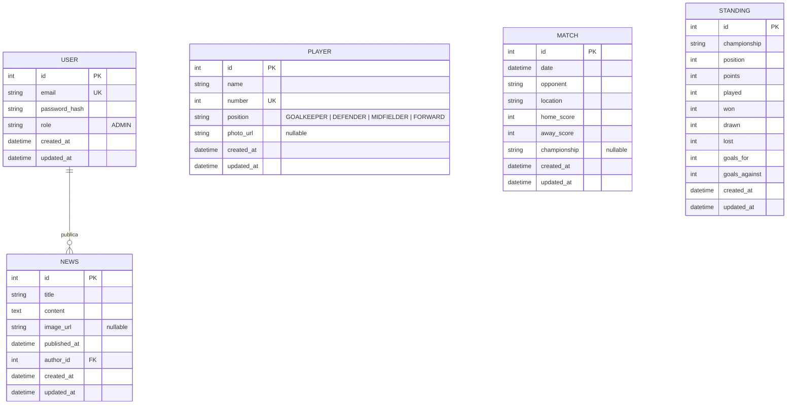

# 📐 Software Design Document (SDD) - La Resenha FC

**Projeto:** La Resenha FC  
**Versão:** 1.0.0  
**Stack Principal:** NestJS, Nuxt, Prisma ORM, PostgreSQL.

---

## 🏗️ 1. Arquitetura do Sistema (Estrutura Monorepo)

O projeto utiliza uma arquitetura de Monorepo. O Agente de IA deve respeitar a seguinte estrutura de pastas:

* **`apps/api`**: Servidor Backend (NestJS). 
* **`apps/web`**: Aplicação Client (Nuxt 4). 

## 🤖 2. Orquestração e Ecossistema de Contexto (MCP)
> **Instrução para a IA:** Este projeto utiliza o Model Context Protocol (MCP) para garantir a paridade entre especificação e execução. Sempre utilize as ferramentas abaixo antes de propor alterações estruturais.

* **GitHub Projects MCP:** Utilize para sincronizar o status das User Stories (PRD) com o desenvolvimento técnico. As definições de "Done" devem seguir os Critérios de Aceitação das Issues.
* **Neon.tech MCP:** Interface obrigatória para introspecção e migração do banco de dados PostgreSQL. O esquema gerado pelo Prisma deve ser validado contra o estado real do banco via este MCP.
* **Stitch MCP (Google):** Utilizado para a geração e prototipação de interfaces Angular. Consulte este contexto para garantir que os componentes sigam os padrões visuais e funcionais definidos no Stitch.

## 📦 3. Stack Tecnológica e Bibliotecas
> Definição estrita das tecnologias permitidas. Nenhuma dependência externa deve ser instalada sem refletir aqui.

### Core & Infraestrutura
* **Ambiente:** Node.js v20.x LTS.
* **Banco de Dados:** PostgreSQL 16 (Hospedado no Neon.tech).
* **Backend:** NestJS v11.x.
* **Frontend:** Nuxt v4.x.
* **ORM:** Prisma v6.x (Interface oficial com o banco de dados).
* **Testes:** `jest` e `supertest` (Obrigatório seguir o padrão oficial do NestJS para testes unitários e E2E. Proibido o uso de Vitest, Mocha ou qualquer outro test runner).

### Bibliotecas e Utilitários Permitidos
* **WebSockets:** Socket.io v4.x (integrado via `@nestjs/platform-socket.io` v10.x).
* **Auth:** Passport.js + JWT (`@nestjs/jwt` e `@nestjs/passport`) para sessões seguras.
* **Validação:** `class-validator` e `class-transformer` (Obrigatório para os Pipes globais de validação de DTOs).
* **Documentação:** `@nestjs/swagger` (OpenAPI 3.0 para os contratos de API).


## 🗄️ 4. Arquitetura de Dados

### 📖 4.1. Glossário Técnico (Mapeamento)
| Termo PRD (PT-BR) | Entidade Técnica (EN) | Atributos Principais |
| :--- | :--- | :--- |
| Gestor | `User` | `id, email, password_hash, role` |
| Jogador / Elenco | `Player` | `id, name, number, position, photo_url` |
| Partida / Resultado | `Match` | `id, date, opponent, home_score, away_score, championship` |
| Notícia / Comunicado | `News` | `id, title, content, image_url, published_at, author_id` |
| Tabela / Classificação | `Standing` | `id, championship, position, points, played, won, drawn, lost` |


### 🗄️ 4.2. Modelagem de Dados (Dicionário de Entidades)

> **Instrução para a IA:** Utilize este diagrama Mermaid como fonte da verdade para gerar o arquivo `schema.prisma` e as migrações do banco de dados.



## 📑 5. Contratos Globais (DTOs & Interfaces)
> Tipagem TypeScript para validação de entrada (Request) e saída (Response).

* **AuthDTO:** `{ idToken: string }` -> Retorna Token JWT + Perfil do Usuário.
* **CreateSessionDTO:** `{ courseId: string, durationMinutes: number }` (Exclusivo Professor).
* **CheckInDTO:** `{ qrToken: string }` -> O `qrToken` é um JWT assinado com validade de 15 segundos.


## 🏗️ 6. Scaffolding Macro (Arquitetura Backend)

### 📂 6.1. Estrutura de Diretórios (Padrão Oficial NestJS CLI)
> **Instrução para a IA:** Organize a pasta `backend/src` utilizando estritamente a arquitetura padrão gerada pelo NestJS CLI (Flat Structure). Cada domínio de negócio deve ser uma pasta direta na raiz do `src/`.

* **`src/auth/`**: Módulo de autenticação. Contém `AuthController`, `AuthService`, `JwtStrategy` e `LocalStrategy`.
* **`src/players/`**: CRUD do elenco. Contém `PlayersController`, `PlayersService` e DTOs.
* **`src/matches/`**: CRUD de partidas e resultados. Contém `MatchesController`, `MatchesService` e DTOs.
* **`src/news/`**: CRUD de notícias. Contém `NewsController`, `NewsService` e DTOs.
* **`src/standings/`**: CRUD da tabela de classificação. Contém `StandingsController`, `StandingsService` e DTOs.
* **`src/prisma/`**: Módulo global contendo o `PrismaService` para injeção de dependência do banco de dados.
* **`src/common/`**: Código transversal — `TransformInterceptor`, `HttpExceptionFilter`, `JwtAuthGuard` e `RolesGuard`.

### 🧠 6.2. Core Services (Singleton)
| Service | Responsabilidade Macro |
| :--- | :--- |
| `PrismaService` | Gerenciar conexão e pooling com o banco PostgreSQL (Neon.tech). |
| `AuthService` | Validar credenciais do gestor e emitir tokens JWT de acesso. |
| `PlayersService` | Encapsular toda a lógica de negócio do CRUD de jogadores. |
| `MatchesService` | Encapsular toda a lógica de negócio do CRUD de partidas. |
| `NewsService` | Encapsular toda a lógica de negócio do CRUD de notícias. |
| `StandingsService` | Encapsular toda a lógica de negócio do CRUD da tabela de classificação. |


## 🛡️ 7. Segurança (API Protection)
> Políticas de acesso e integridade dos dados no nível do servidor.

* **ValidationPipe:** Configurado com `whitelist: true` para ignorar campos não mapeados nos DTOs.
* **JWT Expiry:** Tokens de usuário (8h); Tokens de QR Code (15 segundos).
* **CORS:** Restrito ao domínio do Frontend e à origem da Extensão Chrome.
* **Rate Limit:** Proteção contra ataques de força bruta na rota de check-in.
* **Tratamento de Erros (Exception Filter):** A IA deve implementar um `GlobalExceptionFilter`. É estritamente proibido retornar erros em formatos arbitrários. Toda falha deve retornar ao (Frontend) neste exato formato JSON:
  ```json
  {
    "statusCode": 400,
    "timestamp": "2026-03-20T23:19:20.000Z",
    "path": "/api/rota",
    "message": "Descrição detalhada do erro ou array de validações"
  }


## 📡 8. Contratos de API (Especificação OpenAPI)

> **Instrução para a IA:** Implemente os Controllers e DTOs seguindo rigorosamente estas definições.

## 📡 8. Contratos de API (Especificação OpenAPI)

> **Instrução para a IA:** Implemente os Controllers e DTOs seguindo rigorosamente estas definições.

### 🔐 Módulo de Autenticação
* **POST** `/auth/login`
    * **Payload:** `{ "email": "string", "password": "string" }`
    * **Regra:** Validar credenciais contra a tabela `users`. Se inválidas, retornar `401 Unauthorized`.
    * **Retorno:** `{ "accessToken": "string", "user": { "id", "email", "role" } }`

### 👕 Módulo de Jogadores
* **GET** `/players`
    * **Acesso:** Público.
    * **Retorno:** `[ { "id", "name", "number", "position", "photoUrl" } ]`
* **GET** `/players/:id`
    * **Acesso:** Público.
    * **Retorno:** `{ "id", "name", "number", "position", "photoUrl" }` ou `404` se não encontrado.
* **POST** `/players`
    * **Acesso:** JWT Admin.
    * **Payload:** `{ "name": "string", "number": "integer", "position": "string", "photoUrl": "string?" }`
    * **Retorno:** `201` com o objeto criado.
* **PATCH** `/players/:id`
    * **Acesso:** JWT Admin.
    * **Payload:** Qualquer subconjunto dos campos de `POST /players`.
    * **Retorno:** Objeto atualizado ou `404` se não encontrado.
* **DELETE** `/players/:id`
    * **Acesso:** JWT Admin.
    * **Retorno:** `204 No Content` ou `404` se não encontrado.

### ⚽ Módulo de Partidas
* **GET** `/matches`
    * **Acesso:** Público.
    * **Retorno:** `[ { "id", "date", "opponent", "location", "homeScore", "awayScore", "championship" } ]` ordenado por `date DESC`.
* **GET** `/matches/:id`
    * **Acesso:** Público.
    * **Retorno:** Objeto da partida ou `404` se não encontrado.
* **POST** `/matches`
    * **Acesso:** JWT Admin.
    * **Payload:** `{ "date": "string (ISO 8601)", "opponent": "string", "location": "string", "homeScore": "integer", "awayScore": "integer", "championship": "string?" }`
    * **Retorno:** `201` com o objeto criado.
* **PATCH** `/matches/:id`
    * **Acesso:** JWT Admin.
    * **Payload:** Qualquer subconjunto dos campos de `POST /matches`.
    * **Retorno:** Objeto atualizado ou `404` se não encontrado.
* **DELETE** `/matches/:id`
    * **Acesso:** JWT Admin.
    * **Retorno:** `204 No Content` ou `404` se não encontrado.

### 📰 Módulo de Notícias
* **GET** `/news`
    * **Acesso:** Público.
    * **Retorno:** `[ { "id", "title", "imageUrl", "publishedAt" } ]` ordenado por `publishedAt DESC`.
* **GET** `/news/:id`
    * **Acesso:** Público.
    * **Retorno:** `{ "id", "title", "content", "imageUrl", "publishedAt", "author" }` ou `404` se não encontrado.
* **POST** `/news`
    * **Acesso:** JWT Admin.
    * **Payload:** `{ "title": "string", "content": "string", "imageUrl": "string?", "publishedAt": "string?" }`
    * **Retorno:** `201` com o objeto criado.
* **PATCH** `/news/:id`
    * **Acesso:** JWT Admin.
    * **Payload:** Qualquer subconjunto dos campos de `POST /news`.
    * **Retorno:** Objeto atualizado ou `404` se não encontrado.
* **DELETE** `/news/:id`
    * **Acesso:** JWT Admin.
    * **Retorno:** `204 No Content` ou `404` se não encontrado.

### 🏆 Módulo de Classificação
* **GET** `/standings`
    * **Acesso:** Público.
    * **Retorno:** `[ { "id", "championship", "position", "points", "played", "won", "drawn", "lost", "goalsFor", "goalsAgainst" } ]` ordenado por `position ASC`.
* **POST** `/standings`
    * **Acesso:** JWT Admin.
    * **Payload:** `{ "championship": "string", "position": "integer", "points": "integer", "played": "integer", "won": "integer", "drawn": "integer", "lost": "integer", "goalsFor": "integer", "goalsAgainst": "integer" }`
    * **Retorno:** `201` com o objeto criado.
* **PUT** `/standings/:id`
    * **Acesso:** JWT Admin.
    * **Payload:** Todos os campos de `POST /standings` (substituição completa do registro).
    * **Retorno:** Objeto atualizado ou `404` se não encontrado.
* **DELETE** `/standings/:id`
    * **Acesso:** JWT Admin.
    * **Retorno:** `204 No Content` ou `404` se não encontrado.
    
## ⚙️ 9. Contrato de Configuração (Environment)
> **Instrução Crítica para a IA:** Nenhum dado sensível ou configurável deve estar *hardcoded*. Utilize o `@nestjs/config` (`ConfigModule`) para carregar e validar as variáveis em tempo de inicialização.

As seguintes variáveis são o contrato obrigatório para o arquivo `.env`:
* `DATABASE_URL` = String de conexão do PostgreSQL (Neon.tech).
* `JWT_SECRET` = Chave para assinar o token de sessão de usuário.
* `JWT_EXPIRES_IN` = Tempo de expiração da sessão (ex: `8h`).

## 🎨 10. Design Tokens (Estética e Identidade Visual)

### 🎨 10.1. Paleta de Cores (Hexadecimal)
* **Primary (Warning Yellow):** `#FACC15` - Usado para CTAs principais, números de camisa e destaques de status.
* **Secondary (Deep Forest):** `#1a4314` - Cor de fundo para seções de destaque e identidade do clube.
* **Background (Pitch Black):** `#131313` - Fundo principal para o visual "dark mode" rústico.
* **Surface (Iron):** `#1c1b1b` - Usado em cards, inputs e tabelas para profundidade.
* **Success (Court Green):** `#86efac` - Indicadores de vitórias e status ativos.

### 🔤 10.2. Tipografia (Famílias de Fontes)
* **Headings (Títulos):** `Oswald` (Sans-serif, Peso 700, Uppercase)
  * *Racional:* Fonte condensada e impactante que remete a placares de ginásio e posters de várzea.
* **Body / UI (Corpo e Interface):** `Manrope` ou `Inter` (Sans-serif, Pesos 400 a 600)
  * *Racional:* Alta legibilidade para leitura de notícias e gestão de dados administrativos.

### 📐 10.3. Estética e Geometria
* **Arredondamento (Border Radius):** `4px` (Cantos levemente suavizados, mantendo a sobriedade).
* **Sombras:** `4px 4px 0px rgba(0,0,0,1)` (Sombras sólidas brutalistas para dar peso aos elementos).

